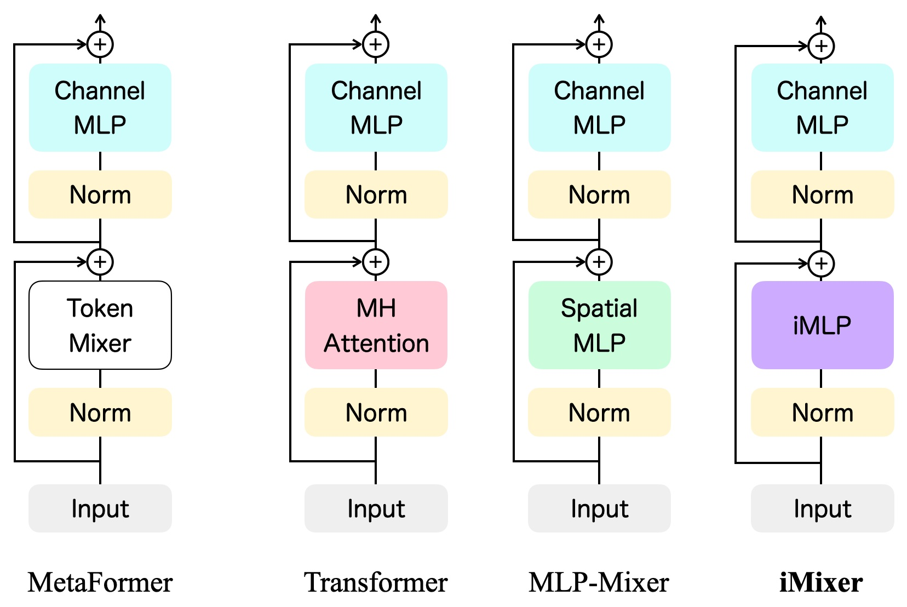
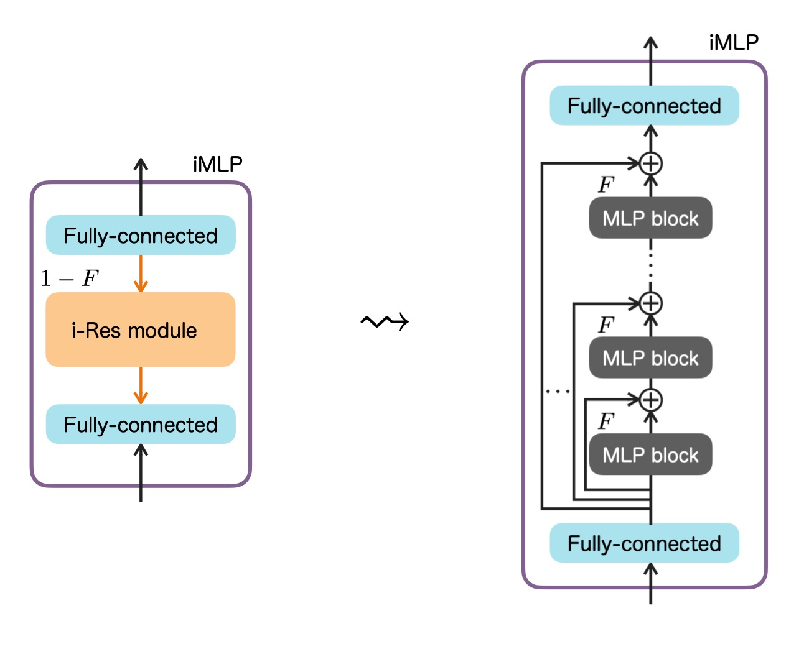

# iMixer: hierarchical Hopfield network implies an invertible, implicit and iterative MLP-Mixer

This is the official PyTorch implementation of iMixer created by

- [Toshihiro Ota](https://github.com/Toshihiro-Ota)<br> [](https://www.cyberagent.co.jp/en/)
- [Masato Taki](https://scholar.google.com/citations?hl=en&user=3nMhvfgAAAAJ)<br> [](https://english.rikkyo.ac.jp)

The paper is available at [arXiv:2304.13061](https://arxiv.org/abs/2304.13061).

## Abstract

In the last few years, the success of Transformers in computer vision has stimulated the discovery of many alternative models that compete with Transformers, such as the MLP-Mixer. Despite their weak inductive bias, these models have achieved performance comparable to well-studied convolutional neural networks. Recent studies on modern Hopfield networks suggest the correspondence between certain energy-based associative memory models and Transformers or MLP-Mixer, and shed some light on the theoretical background of the Transformer-type architectures design. In this paper we generalize the correspondence to the recently introduced hierarchical Hopfield network, and find *iMixer*, a novel generalization of MLP-Mixer model. Unlike ordinary feedforward neural networks, iMixer involves MLP layers that propagate forward from the output side to the input side. We characterize the module as an example of invertible, implicit, and iterative mixing module. We evaluate the model performance with various datasets on image classification tasks, and find that iMixer, despite its unique architecture, exhibits stable learning capabilities and achieves performance comparable to or better than the baseline vanilla MLP-Mixer. The results imply that the correspondence between the Hopfield networks and the Mixer models serves as a principle for understanding a broader class of Transformer-like architecture designs.

## Network Architecture

The schematic diagram of the iMixer architecture as a form of MetaFormers is depicted as follows:

<p align="center">
  
</p>

Basic structure of the proposed iMLP module involved in iMixer as its token mixer is shown below. The invertible ResNet (i-Res) module represents the backward-forward operation in the iMLP module as an infinitely iterated MLP blocks:

<p align="center">
  
</p>

For more details on the iMixer architecture and its derivation, see Sec. 4 of [the paper](https://arxiv.org/abs/2304.13061).

## Model Configuration

iMixer models trained on CIFAR-10 from scratch:

| Model    | Name                 | Parameters | Top-1 Acc. (%) |
| ---      | ---                  | :---:      | :---:          |
| iMixer-S | `imixer_s16_224`     | 20M        | 88.56          |
| iMixer-B | `imixer_b16_224`     | 66M        | 89.07          |
| iMixer-L | `imixer_l16_224`     | 232M       | 87.48          |

## Usage

### Requirements

```python
torch>=1.12.1
torchvision>=0.13.1
timm==0.6.11
matplotlib
scipy
...
```

etc. See [requirements.txt](requirements.txt).

### Training

Run the following in your command line for training iMixer models on CIFAR-10 from scratch on 4 GPUs.

```python
./distributed_train.sh 4 /path/to/cifar10 \
  --dataset torch/cifar10 \
  --num-classes 10 \
  --model imixer_s16_224 \
  --batch-size 512 \
  --workers 4 \
  --opt adamw \
  --epochs 300 \
  --sched cosine \
  --amp \
  --img-size 224 \
  --drop-path 0.1 \
  --lr 5e-4 \
  --weight-decay 0.05 \
  --remode pixel \
  --reprob 0.25 \
  --aa rand-m9-mstd0.5-inc1 \
  --smoothing 0.1 \
  --mixup 0.8 \
  --cutmix 1.0 \
  --warmup-lr 1e-6 \
  --warmup-epochs 20 \
  --h_ratio 2 \
  --n_power 8 \
  --n_iter 2
```

## Acknowledgment

Our implementation is based on [pytorch-image-models](https://github.com/huggingface/pytorch-image-models) and [invertible-resnet](https://github.com/jhjacobsen/invertible-resnet). We greatly appreciate their excellent works.

|   |   |
|:--|:-:|
|  We thank [Graduate School of Artificial Intelligence and Science, Rikkyo University (Rikkyo AI)](https://ai.rikkyo.ac.jp) which supports us with computational resources, facilities, and others. |  ![logo-rikkyo-ai] |

[logo-rikkyo-ai]: assets/RIKKYOAI.png "Logo of Rikkyo AI"

## Citation

If you find our code useful, please cite the accompanying paper:

```bibtex
@article{ota2023imixer,
  title   = {iMixer: hierarchical Hopfield network implies an invertible, implicit and iterative MLP-Mixer},
  author  = {Ota, Toshihiro and Taki, Masato},
  journal = {arXiv preprint arXiv:2304.13061},
  year    = {2023}
}
```

## License

This project is licensed under the Apache License, Version 2.0 (the "License"). See [LICENSE](./LICENSE) for details.
